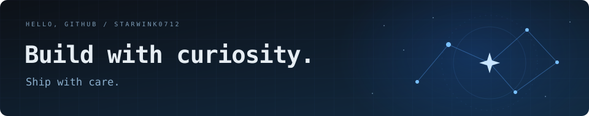

  

<h1 align="center">你好，我是 <a href="https://github.com/StarWink0712">OgawaAya</a></h1>

  

  
  
  
  

---

### 关于我

- 主要做 **Java / Go 后端**，也会用 Swift 写点 macOS 工具。
- 业余在做一个算法可视化工具 **AlgoMotion**。
- 欢迎交流后端、算法可视化、macOS 开发。

### 语言与工具

  &nbsp;&nbsp;
  &nbsp;&nbsp;
  &nbsp;&nbsp;
  &nbsp;&nbsp;
  &nbsp;&nbsp;
  &nbsp;&nbsp;
  &nbsp;&nbsp;
  

### 项目

| 项目 | 简介 | 技术 |
| :--- | :--- | :--- |
| **[AlgoMotion](https://github.com/StarWink0712/AlgoMotion)** | 算法可视化工具，内置 LeetCode Hot 100 动画，支持自定义输入和 AI 生成演示。 | TypeScript · React · Python |
| **[BreezePic](https://github.com/StarWink0712/BreezePic-macOS-Image-Viewer)** | macOS 看图与图片编辑工具，支持文件夹浏览、本机照片和常用编辑，当前是 Alpha 源码版。 | Swift · SwiftUI · AppKit |
| **[ContextKit](https://github.com/StarWink0712/ContextKit-macOS-Finder-Right-Click-Context-Menu)** | Finder 右键菜单增强，补上文件创建、复制粘贴和路径工具。 | Swift · SwiftUI · Finder Sync |

### 学习项目

| 项目 | 简介 | 技术 |
| :--- | :--- | :--- |
| **[rpc-github-sqc](https://github.com/StarWink0712/rpc-github-sqc)** | 手写 RPC 框架，含 Netty 通信、ZooKeeper 注册中心、SPI 扩展和多种序列化，附面试准备文档。 | Java · Netty · ZooKeeper |
| **[interview_guide_ownLearning](https://github.com/StarWink0712/interview_guide_ownLearning)** | 基于 LLM + RAG 的智能面试项目，Spring Boot 后端 + React 前端，支持语音面试和知识库问答。 | Java · Spring Boot · React |
| **[12306_learning](https://github.com/StarWink0712/12306_learning)** | 12306 购票系统的微服务学习实现，含网关、订单、支付、票务等模块。 | Java · Spring Cloud · ShardingSphere |

<a href="https://github.com/StarWink0712?tab=repositories">查看全部仓库 →</a>

---

### GitHub 一览

  <picture>
    <source media="(prefers-color-scheme: dark)" srcset="./assets/stats-dark.svg" />
    
  </picture>
  <picture>
    <source media="(prefers-color-scheme: dark)" srcset="./assets/languages-dark.svg" />
    
  </picture>

  <picture>
    <source media="(prefers-color-scheme: dark)" srcset="./assets/github-contribution-grid-snake-dark.svg" />
    
  </picture>

<samp>Thanks for stopping by.</samp>

